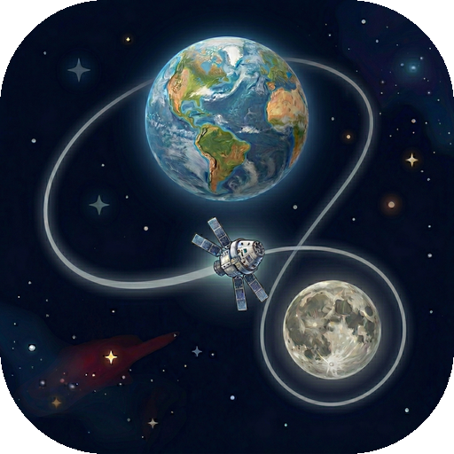
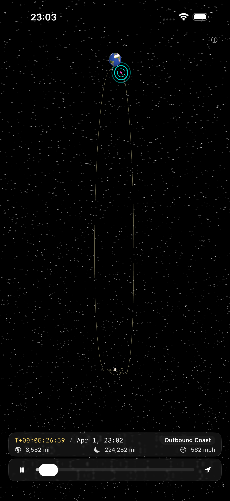

<p align="center">
  
</p>

<h1 align="center">ArtemisTrack</h1>

<p align="center">
  Realtime 3D visualization of the Artemis II lunar flyby mission
</p>

<p align="center">
  
  
  
  
</p>

---

<p align="center">
  
</p>

## About

ArtemisTrack is an iOS app that visualizes the [Artemis II](https://www.nasa.gov/mission/artemis-ii/) free-return lunar flyby in a 3D scene. It renders Earth, the Moon, and the spacecraft's trajectory path in real time, showing the current position of NASA's Orion capsule as it travels to the Moon and back.

The app works entirely offline with no external dependencies — built with pure Apple frameworks (SceneKit + SwiftUI).

## Features

- **3D Earth & Moon** — Textured spheres with NASA Blue Marble imagery, normal/specular maps, night city lights emission, and lunar surface textures against a procedural starfield
- **Trajectory visualization** — The full ~10-day free-return path rendered as a 3D spline with distinct past (traveled) and future segments
- **Spacecraft tracking** — A glowing indicator showing Orion's interpolated position along the trajectory
- **Mission HUD** — Mission Elapsed Time (MET), current date/time, mission phase label, distances from Earth and Moon, and velocity — all in a glass-effect overlay
- **Time controls** — Play/pause, timeline scrubber, and speed multiplier to watch the full mission unfold
- **Analytical ephemeris** — Moon position computed from Keplerian orbital elements for astronomical accuracy without network calls
- **Gesture controls** — Pinch-to-zoom and pan to explore the scene from any angle

## Mission Timeline

| Phase | Timing | Description |
|---|---|---|
| Launch + Parking Orbit | T+0 to T+2h | LEO at ~185 km, 1–2 orbits |
| Trans-Lunar Injection | T+2h | ICPS burn, depart Earth |
| Outbound Coast | Day 1–4 | Coast toward the Moon |
| Lunar Flyby | Day 4–5 | Closest approach ~8,900 km above the far side |
| Return Coast | Day 5–9 | Free-return trajectory back to Earth |
| Re-Entry & Splashdown | Day ~10 | Skip-entry, Pacific splashdown |

## Architecture

```
Artemis/
  App/
    ArtemisApp.swift              # App entry point
    ContentView.swift             # Root view: SceneKit viewport + HUD overlay
    HUDView.swift                 # Mission stats overlay (MET, distances, velocity)
    TimeControlsView.swift        # Play/pause, scrubber, speed controls
  Scene/
    OrbitSceneController.swift    # Owns the SCNScene; creates and updates all nodes
    StarfieldGenerator.swift      # Procedural starfield background
  Bodies/
    EarthNode.swift               # Earth sphere + textures + axial tilt + rotation
    MoonNode.swift                # Moon sphere + texture + tidal locking
    SpacecraftNode.swift          # Glowing indicator for Orion's position
    TrajectoryNode.swift          # Mission path rendered as 3D geometry
  Data/
    MissionTimeline.swift         # Trajectory waypoints (position + timestamp)
    TrajectoryInterpolator.swift  # Catmull-Rom spline interpolation along the path
    EphemerisProvider.swift       # Analytical lunar ephemeris
```

## Building

ArtemisTrack uses [XcodeGen](https://github.com/yonaskolb/XcodeGen) for project generation.

```bash
# Generate Xcode project
xcodegen generate

# Open in Xcode
open Artemis.xcodeproj
```

Requires Xcode 26+ and an iOS 26+ device or simulator.

## Credits

- Earth textures from [NASA Visible Earth](https://visibleearth.nasa.gov/) (Blue Marble, Black Marble) — public domain
- Moon texture from NASA Lunar Reconnaissance Orbiter imagery — public domain
- Trajectory data derived from NASA's published Artemis II mission profile

## License

All rights reserved.
